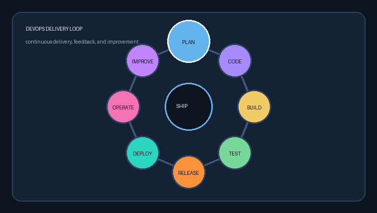

# Shubhankar Thapliyal

## Azure DevOps Engineer | Technical Lead | Aspiring Microsoft Forward Deployment Engineer

I build reliable Azure and AWS delivery platforms through CI/CD, Terraform, Ansible, cloud automation, and production-focused engineering.

**8+ years · Azure · AWS · Azure DevOps · GitHub Actions · GitLab CI/CD · Django · .NET · Terraform · Ansible · Docker · Kubernetes**

	

	
	
	

	
	

	
	
	
	
	

	
	

	
	

<strong>More about me</strong>

I am a Technical Lead and DevOps Engineer based in New Delhi, India, with 8+ years of experience turning complex delivery and operations problems into reliable engineering systems.

- **What I build:** cloud-agnostic platforms across Azure and AWS, with Terraform, Ansible, Docker, Kubernetes, Azure DevOps, GitHub Actions, and GitLab CI/CD.
- **How I work:** make delivery repeatable, keep infrastructure reviewable, design for failure, and leave teams with clear runbooks and ownership.
- **Where I add value:** platform modernization, shared automation, CI/CD enablement, production troubleshooting, governance, security, and operational readiness.
- **Recent impact:** improved deployment speed by 35%, reduced production resolution time by 25%, and helped reduce manual automation effort by 60% through reusable tooling.
- **Current direction:** Microsoft Forward Deployment Engineering, combining technical depth with customer-facing implementation and practical problem solving.
- **Outside work:** technical blogging, non-fiction, horology, motorcycle restoration, adventure touring, and exploring cuisines.
- **Languages:** English and Hindi.
- **Open to:** conversations about Azure delivery, DevOps automation, platform engineering, and thoughtful technical leadership.

## DevOps Delivery Cycle

	

	
	
	
	
	

Plan -> Build -> Test -> Deploy -> Monitor -> Improve

<strong>🧭 Quick navigation</strong>

- [🚀 Featured Repositories](#-featured-repositories)
- [🎓 Interview Readiness Tutorials](#-interview-readiness-tutorials)
- [🎯 Current Direction](#-current-direction)
- [📈 Highlights](#-highlights)
- [🧰 Technology Stack](#-technology-stack)
- [🎉 Fun Corner](#-fun-corner)
- [🤝 Connect](#-connect)
- [📄 ATS Resume](RESUME.md)

## 🎓 Interview Readiness Tutorials

<strong>Open the cloud, automation, and platform interview tracks</strong>

### Ansible for DevOps

[Repository](https://github.com/Shubhankart101/AnsibleForDevOpsRepoForNotes) · [120-question bank](https://github.com/Shubhankart101/AnsibleForDevOpsRepoForNotes/blob/main/interview.md) · [Beginner code](https://github.com/Shubhankart101/AnsibleForDevOpsRepoForNotes/tree/main/interview-prep/beginner) · [Intermediate code](https://github.com/Shubhankart101/AnsibleForDevOpsRepoForNotes/tree/main/interview-prep/intermediate) · [Advanced code](https://github.com/Shubhankart101/AnsibleForDevOpsRepoForNotes/tree/main/interview-prep/advanced)

### Kubernetes and Docker for DevOps

[Repository](https://github.com/Shubhankart101/Kubernetes-DockerForDevOpsRepoForNotes) · [120-question bank](https://github.com/Shubhankart101/Kubernetes-DockerForDevOpsRepoForNotes/blob/main/interview.md) · [Beginner code](https://github.com/Shubhankart101/Kubernetes-DockerForDevOpsRepoForNotes/tree/main/interview-prep/beginner) · [Intermediate code](https://github.com/Shubhankart101/Kubernetes-DockerForDevOpsRepoForNotes/tree/main/interview-prep/intermediate) · [Advanced code](https://github.com/Shubhankart101/Kubernetes-DockerForDevOpsRepoForNotes/tree/main/interview-prep/advanced)

### GitLab for DevOps

[Repository](https://github.com/Shubhankart101/GitlabForDevOpsRepoForNotes) · [120-question bank](https://github.com/Shubhankart101/GitlabForDevOpsRepoForNotes/blob/main/interview.md) · [Beginner code](https://github.com/Shubhankart101/GitlabForDevOpsRepoForNotes/tree/main/interview-prep/beginner) · [Intermediate code](https://github.com/Shubhankart101/GitlabForDevOpsRepoForNotes/tree/main/interview-prep/intermediate) · [Advanced code](https://github.com/Shubhankart101/GitlabForDevOpsRepoForNotes/tree/main/interview-prep/advanced)

### Python for DevOps

[Repository](https://github.com/Shubhankart101/PythonScriptingForDevOpsRepoForNotes) · [120-question bank](https://github.com/Shubhankart101/PythonScriptingForDevOpsRepoForNotes/blob/main/interview.md) · [Beginner code](https://github.com/Shubhankart101/PythonScriptingForDevOpsRepoForNotes/tree/main/beginner) · [Intermediate code](https://github.com/Shubhankart101/PythonScriptingForDevOpsRepoForNotes/tree/main/intermediate) · [Advanced code](https://github.com/Shubhankart101/PythonScriptingForDevOpsRepoForNotes/tree/main/advanced)

### PowerShell for DevOps

[Repository](https://github.com/Shubhankart101/PowershellScriptingForDevOpsRepoForNotes) · [120-question bank](https://github.com/Shubhankart101/PowershellScriptingForDevOpsRepoForNotes/blob/main/interview.md) · [Beginner code](https://github.com/Shubhankart101/PowershellScriptingForDevOpsRepoForNotes/tree/main/beginner) · [Intermediate code](https://github.com/Shubhankart101/PowershellScriptingForDevOpsRepoForNotes/tree/main/intermediate) · [Advanced code](https://github.com/Shubhankart101/PowershellScriptingForDevOpsRepoForNotes/tree/main/advanced)

### Terraform for DevOps

[Repository](https://github.com/Shubhankart101/TerraformRepoForNotes) · [120-question bank](https://github.com/Shubhankart101/TerraformRepoForNotes/blob/main/interview.md) · [Beginner code](https://github.com/Shubhankart101/TerraformRepoForNotes/tree/main/beginner) · [Intermediate code](https://github.com/Shubhankart101/TerraformRepoForNotes/tree/main/intermediate) · [Advanced code](https://github.com/Shubhankart101/TerraformRepoForNotes/tree/main/advanced)

### Shell for DevOps

[Repository](https://github.com/Shubhankart101/ShellScriptingForDevOpsRepoForNotes) · [120-question bank](https://github.com/Shubhankart101/ShellScriptingForDevOpsRepoForNotes/blob/main/interview.md) · [Beginner code](https://github.com/Shubhankart101/ShellScriptingForDevOpsRepoForNotes/tree/main/beginner) · [Intermediate code](https://github.com/Shubhankart101/ShellScriptingForDevOpsRepoForNotes/tree/main/intermediate) · [Advanced code](https://github.com/Shubhankart101/ShellScriptingForDevOpsRepoForNotes/tree/main/advanced)

## 🚀 Featured Repositories

	
	
	
	
	

## 🎯 Current Direction

Moving toward Microsoft Forward Deployment Engineering by combining Azure delivery expertise with customer-focused implementation, production troubleshooting, operational readiness, and practical technical problem solving.

<strong>What I bring to a deployment team</strong>

- Cloud platform implementation across Azure and AWS
- CI/CD pipeline design, release automation, and continuous testing
- Terraform and Ansible infrastructure automation
- Production incident troubleshooting and Level 3 escalation
- Monitoring, security, governance, and operational readiness
- Clear communication across engineering, QA, cloud, and customer teams

## 📈 Highlights

- Improved infrastructure deployment speed by **35%** through Terraform and automation.
- Reduced complex production issue resolution time by **25%** through Level 3 escalation and troubleshooting.
- Built enterprise Ansible automation and CI/CD delivery platforms across Azure and AWS.
- Hold Microsoft DevOps Engineer Expert, Azure Solutions Architect Expert, Azure Administrator Associate, and HashiCorp Terraform Associate certifications.

<strong>Certification details</strong>

- Microsoft Certified: DevOps Engineer Expert
- Microsoft Certified: Azure Solutions Architect Expert
- Microsoft Certified: Azure Administrator Associate
- Microsoft Certified: Azure Fundamentals
- Microsoft Certified: Machine Learning Operations Engineer Associate
- HashiCorp Certified: Terraform Associate (003)
- Microsoft Certified: Agentic AI Business Solutions Architect

## 🧰 Technology Stack

	
	
	
	
	
	
	
	
	
	
	
	
	
	
	

	
	
	

## 🎉 Fun Corner

<strong>One small deployment joke</strong>

<!-- FUN_CORNER_START -->
> Why did the infrastructure engineer review the plan twice?
>
> Because production deserves a second look.

	

<!-- FUN_CORNER_END -->

## 🤝 Connect

